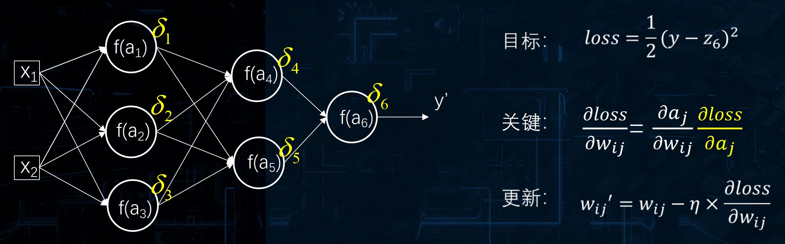
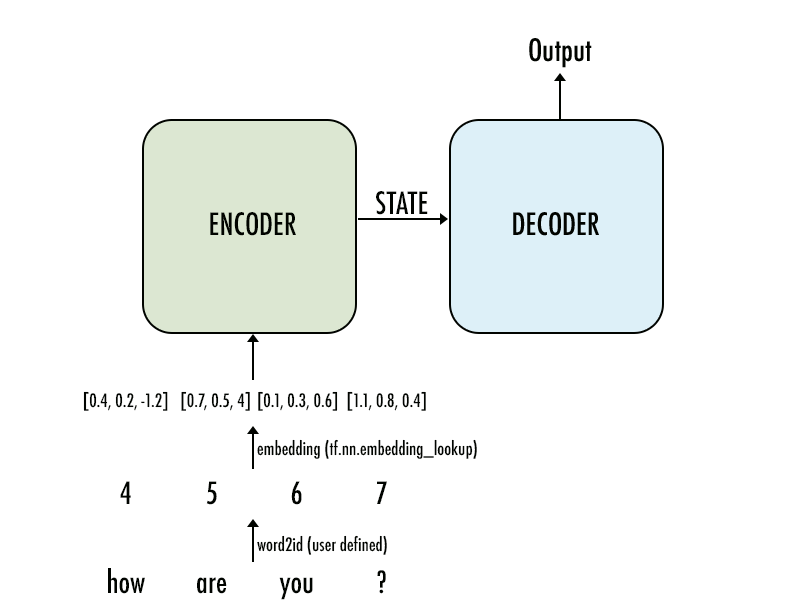

# 自然语言处理

## 预备知识：神经网络的反向传播

- 一个简单例子（不含激活函数）


（a）前向运算

>$h1=w1*x1+w2*x2$
>
>$h2=w3*x1+w4*x2$
>
>$y=w5*h1+w6*h2$
>
>$Loss=\frac{1}{2}*(y-t)^2$

（b）反向传播

以 $w1$ 和 $w2$ 的反传为例：


- 包含激活函数的例子


（a）前向运算


（b）反向传播

（1） $w^2_{11}$ 和 $w^2_{21}$ 的反传：


（2） $w^1_{11}$ 和 $w^1_{12}$ 的反传：


（3） $w^1_{21}$ 和 $w^1_{22}$ 的反传：


- 关键：残差的计算

反向传播关键在于残差的计算，其通向公式如下：



残差的具体推导过程如下：


由此可得权值更新过程如下所示：


> **梯度消散问题：**有两部分原因会产生梯度消散的问题
>
> （1）激活函数的导数可能是一个小数，反向乘的过程中可能会使得梯度变小
>
> （2）各个边上的权值也有可能是一个小数，也会导致梯度变小

### 反向传播的推导过程

- 计算最后一层的残差


- 根据后一层的残差计算前一层的残差


- 根据每一层的残差更新每一层的权重


>对于残差的理解？
>
>（1）通过网络向后传播的 "误差 "可以被认为是每个单元对偏置扰动的 "敏感度"
>
>（2）残差表明了该节点对最终输出值的残差产生了多少影响

## RNN（递归神经网络）

**产生背景：**传统的 BP 神经网络和卷积神经网络的输入是一个独立的、没有上下文联系的单位，而对于一些有明显的上下文特征的序列化输入，比如预测视频中下一帧的播放内容，这样的输出必须依赖**以前的输入**， 也就是说网络必须拥有一定的**记忆能力**，RNN构建了一种特殊结构的神经网络，赋予网络这样的记忆力

**序列数据：**具有时间维度的数据通常会被看做序列数据，序列数据通常每个时间点会有一个**数据单元**。例如一个单词可以将一个字母堪称一个数据单元。一个句子，可以将一个单词看成一个数据单元。一篇文章，可以将一个句子看出数据单元。一本书，可以将一篇文章看成一个数据单元。不同的数据单元表示决定了序列的基本组成部分

### 基本结构

RNN 基本结构如下图所示：


>为什么需要隐层状态进行循环？

- 仅将上一时刻输入进行循环


- 循环隐含层


- RNN 的输入输出表示如下：


>$h(t)=f(z^t)=f(Ux^t+Wh^{t-1}+b)$
>
>$y^t=f(Vh^t+c)$

其展开示意图如下：


一个多层的 RNN 示意图如下：


### RNN的反向传播 （BPTT）

- RNN 的梯度消失问题


- 隐藏层节点在 t 时刻的 delta


- BPTT直接求导


>RNN的反向传播可以从两部分考虑
>
>（1）反向传播需要把每一个时刻产生的 `Loss `加起来
>
>（2）对于每一个时刻而言，它对 `U、V、W` 的影响需要沿时序维度传递回去

## LSTM（长短时记忆网络）

LSTM诞生于1997年，作者是 `Juergen Schmidhuber`

### RNN 存在的问题

RNN存在显著的长时依赖问题，因为输入信息在向后传递的过程中需要累乘以 `W` 矩阵，所以越往前的信息对当前时刻隐藏层的影响越小，这使得RNN在处理长序列时效果不好，RNN存在持续的遗忘

### LSTM的神经元结构

LSTM神经元的结构如下所示：


RNN和LSTM的区别如下：


>$c$ 变化很慢，$c^t$ 等于 $c^{t-1}$ 加上个时刻的信息
>
>$h$ 变化很快，$h^t$ 和 $h^{t-1}$ 可以完全不一样

- 遗忘门


- 输入门


 

- 输出门


- 公式整合


- 深入理解 LSTM


### LSTM的反向传播


## Seq2Seq

Seq2Seq模型本质上是一个 `N to M ` 的模型结构，可应用于：

- 机器翻译
- 文章内容摘要
- 问答机器人
- 图片描述

举例：机器翻译的 Seq2Seq 模型结构如下：


> Seq2Seq 模型为什么需要两个网络？
>
> 因为一个网络的不能展示输入输出的对应关系，所以需要一个编码网络来计算出一个Context并将其传入到解码网络，利用解码网络来生成预测结果

- `N to M` 模型可以看成一个 `N to 1` 模型加上 `1 to M` 模型

### 关键：所传递的 Context

一般而言，传递的 `Context`  为编码器的隐藏层状态 `final_state`

### 架构范式



### Seq2Seq 的改进

- 直接预测一条序列有难度，有点像分开预测单个词
- 给输入序列的信息，以及真实的上一个词的信息，预测下一个词的信息
- 将 `N to 1 -> 1 to M `的模型变成 `N to 1 -> M to M` 的模型，模型结构如下：


### 改进的 Seq2Seq 网络结构

改进的 Seq2Seq 模型包含 Encoder 和 Decoder 网络，其结构如下图所示：


- 改进后的模型有两个输入：一个是 x 输入作为 Encoder 的输入，另一个是 y 输入作为Decoder 的输入，所以在 seq2seq 的训练中，标签 y 既参与计算 loss，又参与节点运算
- C 节点是 Encoder 最后一个时间步长的隐藏状态，它将作为 Decoder 中 cell 的初始状态
- 在训练中，Decoder 的隐藏状态 `h(t)` 就由上一个隐藏状态 `h(t-1) `，`y(t-1) `和 `C ` 三部分构成

### Seq2Seq 生成模型的实现流程

一个简单的 Seq2Seq 实现流程如下图所示：


## 注意力机制

###  Seq2Seq 的问题

- 固定长度上下文向量具有一个明显的致命缺点——无法记忆长句子。一旦完成编码器输入序列的处理，就会遗忘开始的部分
- 将数据压缩到 Context 中可能会损失一些信息
- 因此注意力机制（Bahdanau et al., 2015）被提出，解决这个问题，Seq2Seq模型中可以加上注意力机制来提升模型表现

>Attention 关键在于对不同的输入使用不同的 Context

### Seq2Seq 中添加 Attention 机制

- 将 decoder 隐含层的输出和 Encoder 隐含层的输出 在时序维度上做**点乘**，得到相应的 Attention Score
- 利用 Softmax 层将将 Attention Score 转化为概率分布，计算出 Encoder 中各个向量对 Deocder 向量的权重
- 利用计算出来的权重，对 Encoder 隐含层的向量做**加权求和**，得到 Attention output
- 将 Attention output 和 Decoder 在隐含层的输出进行 **Concat**，得到最终的输出结果

在 Seq2Seq 中添加 Attention 机制的实现流程如下图所示：


### Attention 的通用解释

- 按照 Stanford 大学课件上的描述，attention 的通用定义如下：给定一组向量集合 values，以及一个向量 query，attention 机制是一种根据该 query 计算 values 的加权求和的机制，attention 的重点就是这个集合 values 中的每个 value 的 **权值** 的计算方法
- 有时候也把这种 attention 的机制叫做 query 的输出关注了（或者说叫考虑到了）原文的不同部分
- 其中：key 向量用来做**相似度**计算，value向量用于做**加权求和**，query向量为输入向量

- 注意力机制可以被描述成将一个**查询Q**匹配到**键值对(K、V)**上进行输出的过程

Attention 的形象化表述例子如下：


## Transformer

Transformer的基本结构如下所示：


在原论文中，设置编码器和解码器的 N 均为 6

### 降尺度的点乘自注意力机制

在数据传递过程中，数据维度变化过程如下：

- 原始数据维度：`(batch_size, seq_length)`
- 进入嵌入层的维度：`(batch_size, seq_length, embedding_size)`
- 自注意力机制：
  - Q向量：全连接网络，变化后维度为：`(batch_size, seq_length, hidden_size)`
  - K向量：全连接网络，变化后维度为：`(batch_size, seq_length, hidden_size)`
  - V向量：全连接网络，变化后维度为：`(batch_size, seq_length, hidden_size)`

**自注意力机制公式：**$Z = softmax(\frac{Q * K^T}{\sqrt{d_k}})*V$

根据该公式可知，Z向量的输出维度为：`(batch_size, seq_length, hidden_size)`

### 多头注意力机制

- 输入维度为：`(batch_size, seq_length, embedding_size)`

- 分解成多个头，数据维度为：`(batch_size, seq_length, head_num, head_size)`

- 对每一个头做降尺度的点乘自注意力机制，单个头的数据维度为：`(batch_size, seq_length, hidden_size)`

- 将多个头的结果合并起来：`MultiHead(Q,K,V)=Concat(head_1,...,head_n)`

### 位置编码


- pos 代表单词的索引，即表示当前单词是第几个单词
- i 代表一个单词中和嵌入维度对应位置的索引
- d_model 代表了嵌入层维度

### Add & Norm

- 通过 Add 机制，防止某一层的输出结果过差，类似于残差网络
- Norm 表示层归一化，层归一化是单个训练数据对某一层所有神经元之间的归一化，批归一化是不同训练数据之间对单个神经元的归一化，注意区别

## BERT

BERT全称是：**Bidirectional Encoder Representations from Transformer**，BERT 只用到了 Transformer 左边的编码器部分，将编码器的输出直接输入到下层网络中，BERT是一个**预训练**模型，此时 Encoder 的 stack 数为 12 或 24

## 文本处理中常见的标点符号

```python
'[\s+\.\!\/_,$%^*(+\"\']+|[+——！，。？、~@#￥%……&*（）]+'
```


